# 📘 SkimKnow SRS (Software Requirements Specification)

---

## 1. Introduction

**SkimKnow** is a multi-source AI-powered content synthesis assistant. It enables users to combine data from diverse formats — including documents, videos, audio, links, and images — into unified, structured summaries using advanced language models.

SkimKnow helps mitigate information overload by generating digestible outputs like TLDRs, timelines, dashboards, and flashcards. It is designed for students, researchers, professionals, and casual users seeking to extract, retain, and organize insights from scattered sources.

This SRS document defines the scope, requirements, system constraints, and planned capabilities of the **Phase 1 MVP**. It will guide the development, testing, and deployment.

---

## 2. Project Scope

### 2.1 Purpose

To provide a single unified workspace for summarizing multiple source formats (e.g. PDF, audio, video, links) into structured outputs using AI.

### 2.2 Features (Phase 1)

- Text-based input (paste or type)
- Upload support: PDF, DOCX, YouTube/Website links, audio (WAV/MP3)
- Summary types: TLDR, Chronological, General Overview (Story Mode optional)
- Merge up to 3–5 summarized files
- UI tabbed summaries
- Folder + file management: Create, Rename, Delete, Move
- Keyword-based search
- Editable summary with save/delete
- Download in Word/PDF formats
- Responsive UI with icon-based source detection
- Drag-and-drop file support
- Inline merge from existing summaries by reactivating input box
- Input validation (format, size, structure)

### 2.3 Deferred Features (Planned for Phase 2+)

- Image OCR for handwritten notes, and scanned image PDFs
- Smart tagging, filters, undo/redo
- Download in Markdown, Excel, PNG, interactive graphs
- Chrome extension to fetch open browser tabs
- Output types: Dashboards, Flashcards, Story Mode, Tabular, Presentation, Research, Statistical, Big Picture
- LLM fallbacks / hybrid agents based on summary type
- Auto-save/versioning, usage tracking
- Offline mode, push notifications, mobile PWA
- Backup and recovery automation
- Performance monitoring with observability tools (Sentry, Prometheus)

#### 📊 Deferred Features Categorized

| Category                  | Planned Features                                                                                     |
|---------------------------|------------------------------------------------------------------------------------------------------|
| **Input Formats**         | Image OCR (scanned image PDFs, diagrams), Notion, Zoom, Podcasts, Google Docs                        |
| **Output Styles**         | Presentation, Tabular, Flashcards, Dashboards, Statistical, Research, Story Mode, Big Picture *Download Formats*: Excel (.xlsx), Markdown (.md), PNG/JPEG, Google Docs                               |
| **AI/LLM Expansion**      | Hybrid LLM routing per summary type, fallback models, auto-prompt selection                          |
| **UI Enhancements**       | Undo/Redo, Theming, Usage Tracking, Auto-save, Drag & Drop, Smart Tabs                               |
| **System-Level Enhancements** | Chrome Extension (fetch tabs), Offline mode, Mobile PWA, Backup/Recovery, Load Balancing         |

### 2.4 Merge Logic

- Users can merge summaries via:
  - **Skim & Merge (Start Flow)**: Add current input + existing summaries
  - **Inline Merge (Post-Skim)**: Add more sources to existing summary, reactivates input area
- Merged summaries are stored locally until saved
- Merge up to 3 formats including cross-type inputs (e.g. PDF + YouTube + link)
- Conflicts or overlapping information are resolved via:
  - AI agent clustering: identify and consolidate redundant or contradictory content
  - Temporal ordering (for chronology), importance ranking (for TLDR), thematic overlap removal
  All of this is achieved by designing purpose-driven prompts dynamically tailored to the input type and summary format.
  
> 🧠 In Phase 2, both merged and individual summaries will be routed through **summary-type-specific prompt templates and LLM model selectors** with fallback logic.  
> This enables **cost-effective, format-aware, and context-optimized** summarization—without requiring the user to choose models manually.

### 2.5 Representative User Types (Open to All)

The user categories described below are illustrative. SkimKnow is designed to be universally useful for anyone dealing with fragmented or multi-format content — regardless of role.

| User Type            | Description                                                    |
|----------------------|----------------------------------------------------------------|
| 🧑‍🎓 Students		   | Want quick notes from textbooks, PDFs, links                   |
| 🧑‍🔬 Researchers  	   | Need comparative and chronological summaries of papers         |
| 💼 Professionals	   | Skim reports, meetings, documents quickly                      |
| 🧠 Neurodivergent    | Prefer structured, visual formats like flashcards, dashboards  |
| 👩‍🏫 Educators         | Need to repurpose content for teaching aids                    |

### 2.6 User Roles & Access Levels

SkimKnow distinguishes between two system-level user roles in Phase 1:

| Role              | Description                             | Access Capabilities                                                                  |
|-------------------|-----------------------------------------|--------------------------------------------------------------------------------------|
| **Guest User**    | Anonymous or unauthenticated visitor    | Can paste/upload content, generate summaries, edit inline, download. No save/merge.  |
| **Logged-in User**| Authenticated via login (email/pass)    | Full access to folder structure, file save/load, summary merge, and persistent edits.|

> 🟡 Guest access is **ephemeral** — their session data is held temporarily in localStorage and cleared on logout or refresh.
> ✅ Only logged-in users can save, rename, organize, or re-access summaries from the backend database.

**Current Tier:**  
Phase 1 supports only **Free Tier** users with fixed limits (5 summaries/day, max 3 sources per merge).

Future tiers (e.g., Educator, Premium, Super) will be defined in later phases and offer extended capabilities.

---

## 3. Functional Requirements

### 3.1 Unified Input Box

- Detects input type: text, file, audio, link
- Auto-highlights icon (e.g., link = 🔗, video = 🎥)
- Drag-and-drop supported
- Only 1 file allowed at a time (2MB max)
- Input validation for file type, format, and length (max 5000 words / 30-min video)

### 3.2 Buttons

- **Skim**: Summarizes new input
- **Skim & Merge**: Summarizes + merges with selected files

### 3.3 Tabbed Summary UI

- Tabs: TLDR, Chronological, General (future: Tabular, Flashcards, etc.)
- "+" icon to add more formats (limited to 3–5 types)
- "×" to remove format tab

### 3.4 Save & Edit

- User edits inline summary
- Must click "Save" to persist to backend
- Can rename files/folders
- Re-summarize button triggers LLM again

#### 3.4.1 Save Logic: Guest vs. Authenticated Users

SkimKnow allows all users, including guests, to upload content, generate summaries, and download them. However, **persistent storage** of summaries or folder structures in the backend is **only permitted for authenticated users**.

**Guest Users:**
- Can upload, summarize, and edit summaries inline
- Can download outputs in PDF/Word format
- Cannot save folders or files to backend
- Work is stored temporarily in local/session storage
- Data is lost on refresh or tab close

**Logged-in Users:**
- Can persist summaries to backend with structured folder/file organization
- Can retrieve, rename, or re-skim saved content across sessions
- Save/merge buttons become active only after login

> ⚠️ Attempting to save as a guest will prompt the user to log in or sign up.

### 3.5 Folder Management

- Collapsible sidebar view
- Create, Delete, Rename folders/files
- Move files between folders

### 3.6 Search

- Keyword search by title or content
- Search bar in header

### 3.7 Merge Flow

- Merge up to 3–5 previously saved summaries
- LLM combines compressed extracted content from sources
- Inline merge supported within tab view

### 3.8 Authentication

- User login required for persistent storage
- Guest users can still summarize and download
- Profile info shown in header after login

### 3.9 Downloads

- Current active tab downloadable as Word or PDF

### 3.10 Interfaces

- **UI**: React + Tailwind + ShadCN
- **Backend**: FastAPI
- **Database**: PostgreSQL
- **File Storage**: S3-compatible
- **API**: REST with JWT session auth
- **Browser**: Must support localStorage, JS
- **Hardware**: Browser-based, no device dependency
- **LLM Layer**:  
  - **Primary LLM (Phase 1)**: Gemini Flash via Google AI Studio  
  - **Prompt Logic**: Dynamic prompts generated based on input type and selected summary format  
  - **LLM Output Handling**: Gemini is instructed via prompts to return summaries in HTML with inline styles, making them UI-ready for rendering in the frontend.
  - **Planned (Phase 2)**: Summary-type-aware LLM Gateway for model selection and fallback logic

---

## 4. Non-Functional Requirements

| Category        | Description                                                         |
| --------------- | ------------------------------------------------------------------- |
| Performance     | LLM response under 10s (upper cap); UI response under 300ms         |
| Scalability     | Solo user support; limit to 5 summaries/day, 3 files per summary    |
| Reliability     | Unsaved content stays in localStorage; backend persists saved files |
| Availability    | Cloud deployment on free-tier environments (e.g., Render/Railway)   |
| Security        | JWT tokens with expiry, HTTPS enforced, no pre-login data retention |
| Usability       | Responsive UI across device sizes, intuitive layout                 |
| Maintainability | Modular components; API versioning supported                        |
| Compatibility   | Works across Chrome, Firefox, Edge; responsive on all dimensions    |
| Portability     | Pure web-app; future PWA-ready                                      |
| Accessibility   | Timeline/visual summaries help neurodivergent learners              |
| Localization    | English only in Phase 1; future support for i18n planned            |

---

## 5. Security & Privacy

- 🔐 **Passwords**: Hashed + salted using bcrypt
- 🔑 **Auth**: JWT-based session tokens with expiry (session control + API security)
- 🔑 **JWT Expiry Handling**: Tokens expire after 24 hours of inactivity; actions like Save or Merge prompt re-authentication on expiry
- 🕈 **No data stored** pre-login; cleared on logout
- 🧪 **Input Sanitization**: All user inputs are validated and sanitized on both frontend and backend to prevent XSS, injection, or malformed requests
- 🔐 **Transport**: HTTPS only (no fallback to HTTP)
- ❌ **No raw source files** stored; only gzip-compressed extracted content saved in backend
- 🧾 **LocalStorage Expiry**: Guest summaries stored in browser localStorage expire automatically after 2 hours
- 🛡 **Rate-Limiting Policy**: Max 5 summaries/day and 3 sources/summary; if exceeded, backend returns HTTP 429 with a Retry-After header
- 🔁 **Retry Mechanism**: Summarization failures (e.g., LLM timeout) are retried once before notifying the user
- 👩‍💻 **Single-user** support in Phase 1 (multi-user roles and teams deferred to Phase 2)
- 🧱 **Guest Storage Limit**: Browser localStorage is capped at ~1.5 MB for guest users (typically ~5 summaries). Exceeding this shows a warning prompting download or login.

---

## 6. Technical & Scaling Constraints

| Area                    | Limitation / Policy                                             |
| ----------------------- | --------------------------------------------------------------- |
| Uploads                 | Max 1 file at a time, up to **2MB** (PDF, DOCX, audio, YouTube) |
| Skim & Merge Limit      | Max **3 sources** per merge                                     |
| Supported Summary Types | TLDR, Chronological, General                                    |
| Input Token Limit       | Text capped at \~**5000 words**                                 |
| YouTube Input           | Only public videos, up to **30 minutes**                        |
| Audio                   | WAV/MP3 with valid speech content                               |
| Save Mechanism          | Manual only; auto-save deferred to Phase 2                      |
| Storage Format          | Gzip-compressed extracted summaries                             |
| Undo/Redo, View Source  | Not available in Phase 1                                        |
| Backup & Recovery       | Deferred to Phase 2                                             |
| Upload Timeout          | Max **10 seconds** per file                                     |
| Max Concurrent Users    | Dev infra supports up to **3–5 concurrent users**               |
| Retry Policy            | One automatic retry for transient failures                      |
| LocalStorage Expiry     | Guest session data expires after **2 hours**                    |
| LocalStorage Limit      | Max ~1.5 MB/session (guest); capped to ~5 merged summaries      |
| Parsing Failure         | Displays error and discards the input                           |
| Summarizing Failure     | Retries once; if it fails again, user is notified               |
| JWT Expiry              | Tokens expire after 7 days; user stays logged in unless cleared |

---

## 7. Assumptions & Dependencies

| ID | Assumption / Dependency                                | Impact if Violated                        |
| -- | ------------------------------------------------------ | ----------------------------------------- |
| A1 | Gemini Flash API remains free and stable               | Summary generation fails or costs rise    |
| A2 | YouTube transcript API or yt-dlp is accessible         | Video summarization feature breaks        |
| A3 | Free-tier DB/infra (Render, Railway, S3) is stable     | Data loss or service unavailability       |
| A4 | LocalStorage is supported on client browser            | Session data lost on refresh              |
| A5 | Only public, short (<=30min) YouTube videos used       | Parsing fails or yields invalid summaries |
| A6 | Browser permissions allow JS parsing for content links | Web page parsing may break                |
| A7 | FastAPI + PostgreSQL + Railway/Render infrastructure   | Ensures zero-cost backend operation       |

➡️ Future mitigation for A1: Hybrid LLM Gateway planned (Phase 2) for fallback model selection and cost-based routing.

---

## 8. Testing Plan

| Type                  | Description                                                            |
| --------------------- | ---------------------------------------------------------------------- |
| **Unit Tests**        | File validators, text parsing, prompt routing                          |
| **Integration Tests** | Upload → Summarize → Save/Merge → Download                             |
| **UI/UX Tests**       | Tab switching, responsive design, inline editing                       |
| **Edge Case Testing** | 2MB upload, corrupted files, malformed URLs                            |
| **Performance**       | LLM summary returned in under **10 seconds**                           |
| **Regression**        | Re-summarize works across formats and states                           |
| **Stress Testing**    | Simulate up to **5 concurrent users** and **50 summary generations**   |
| **Error Handling**    | Covers malformed files, parsing failure, LLM timeout, expired sessions |
| **Retry Testing**     | Transient failures retried once, fallback message shown on fail        |
| **Rate Limiting**     | Trigger and validate `HTTP 429` on usage limits breach                 |

**Acceptance Criteria:**

- ✅ Summary displays correctly for input
- ✅ Merge result combines input and saved summaries
- ✅ Save persists content to backend
- ✅ Folders/files reflect rename/delete operations

---

## 9. UML Diagrams

### 9.1 Use Case Diagram

The following use case diagram represents actions available to guest users and logged-in users during Phase 1. Logged-in users can persist, organize, and search files, while guests have access to temporary skim-and-download functionality only.

### 9.2 Sequence Diagram (Skim & Merge)

```mermaid
sequenceDiagram
    participant U as User
    participant UI
    participant BE as Backend
    participant PS as Parsing Service
    participant LO as LLM Orchestrator
    participant GEM as Gemini LLM
    participant LS as Local Storage
    participant DB as Backend DB

    Note over U, UI: 🔄 Basic Skim Flow
    U->>UI: Upload / Paste Input
    activate UI
    UI->>UI: Validate Input (type, size)
    UI->>BE: Send Validated Input
    activate BE
    BE->>PS: Route to appropriate Parser (PDF, YouTube, etc.)
    activate PS
    PS-->>BE: Return Parsed Content
    deactivate PS
    BE->>LO: Send Parsed Content
    activate LO
    LO->>GEM: Prompt Gemini (with inline styles)
    activate GEM
    GEM-->>LO: Return Styled Summary (HTML)
    deactivate GEM
    LO-->>BE: Forward to Backend
    deactivate LO
    BE-->>UI: Return Styled Summary to UI
    deactivate BE
    UI-->>U: Display Summary
    UI->>LS: Save in LocalStorage
    deactivate UI

    Note over U, UI: ➕ Inline Add Source
    U->>UI: Click "Add Source"
    activate UI
    UI->>UI: Validate New Input
    UI->>BE: Send New Input + Existing Summary from LS
    activate BE
    BE->>PS: Parse New Input
    activate PS
    PS-->>BE: Return Parsed Content
    deactivate PS
    BE->>LO: Summarize New Input
    activate LO
    LO->>GEM: Prompt Gemini (new content)
    activate GEM
    GEM-->>LO: Return Summary
    deactivate GEM
    LO-->>BE: Return Summary
    deactivate LO
    BE->>LO: Aggregate (Existing + New Summaries)
    activate LO
    LO->>GEM: Prompt Gemini for Combined Summary
    activate GEM
    GEM-->>LO: Return Merged Summary (Styled)
    deactivate GEM
    LO-->>BE: Forward Merged Summary
    deactivate LO
    BE-->>UI: Display Final Merged Output
    deactivate BE
    UI-->>U: Show Final Summary
    UI->>LS: Replace Summary in LocalStorage
    deactivate UI

    Note over U, UI: 💾 Save Attempt
    U->>UI: Click Save
    activate UI
    UI->>UI: Check Login Status
    alt Guest User
        UI-->>U: Show Login Prompt
    else Logged-In User
        UI->>BE: Send Summary to Backend
        activate BE
        BE->>DB: Save File/Folder Structure
        DB-->>BE: Acknowledge Save
        BE-->>UI: Confirm Save
        deactivate BE
        UI-->>U: Show Save Confirmation
    end
    deactivate UI

    Note over U, UI: 🔁 Skim & Merge from Saved Files
    U->>UI: Click "Skim & Merge"
    activate UI
    UI-->>U: Show File Picker
    U->>UI: Select Saved File
    UI->>BE: Send New Input + Selected File
    activate BE
    BE->>DB: Fetch Saved Summaries
    DB-->>BE: Return Summaries
    BE->>LO: Send Summaries to Aggregator
    activate LO
    LO->>GEM: Prompt Gemini to Merge
    activate GEM
    GEM-->>LO: Return Merged Output
    deactivate GEM
    LO-->>BE: Return Final Summary
    deactivate LO
    BE-->>UI: Show Summary
    deactivate BE
    UI->>U: Allow Edit / Download / Save
    deactivate UI

    Note over U, UI: ⬇️ Download Summary
    U->>UI: Click Download
    UI->>BE: Request File Format
    activate BE
    BE-->>UI: Return Word/PDF
    deactivate BE
    UI->>U: Download Triggered

```

### 9.3 State Machine Diagram (Input Flow)

---

## 10. Appendix / References

- Gemini API: [https://ai.google.dev](https://ai.google.dev)
- yt-dlp: [https://github.com/yt-dlp/yt-dlp](https://github.com/yt-dlp/yt-dlp)
- YouTube Transcript API: [https://pypi.org/project/youtube-transcript-api/](https://pypi.org/project/youtube-transcript-api/)
- FastAPI Docs: [https://fastapi.tiangolo.com](https://fastapi.tiangolo.com)
- Tailwind CSS: [https://tailwindcss.com](https://tailwindcss.com)
- OpenAI GPT-3.5: [https://platform.openai.com/docs](https://platform.openai.com/docs)
- Railway Hosting: [https://railway.app](https://railway.app)
- Render Hosting: [https://render.com](https://render.com)
- PostgreSQL DB: [https://www.postgresql.org](https://www.postgresql.org)

---

## 11. Error Handling & Failure Recovery

SkimKnow Phase 1 implements limited error resilience focused on guest users and summary reliability.

### LLM Failure Recovery
- Retry policy: 2 attempts with backoff delay
- Timeout: 10s maximum per call
- Fallback: If all retries fail, a styled error is returned to the UI

### Input & Upload Errors
- Malformed or unsupported file types are blocked
- Uploads exceeding size/time limits are rejected with messages

### Guest Session Expiry
- Guest data stored in localStorage is ephemeral and expires after 2 hours or on browser close
- Guest attempts to save trigger login prompt

### Auth Expiry & Token Failures
- JWT session expires after 60 minutes idle time
- Expired tokens redirect users to login flow before retrying action

### Download Failures
- UI uses HTML-rendered preview; if unavailable, disables download action

### Edge Failures (Planned in Phase 2)
- DB write failures, rate-limit violations, and multi-user contention will be handled via observability tools like Sentry & Prometheus

## 12. Glossary

| **Term**                   | **Definition**                                                                                          |
| -------------------------- | ------------------------------------------------------------------------------------------------------- |
| **AI**                     | Artificial Intelligence – simulation of human intelligence in machines to perform tasks.                |
| **LLM**                    | Large Language Model – AI models trained on massive text datasets to understand/generate language.      |
| **TLDR**                   | "Too Long; Didn’t Read" – ultra-concise summary for quick understanding.                                |
| **OCR**                    | Optical Character Recognition – technology to extract text from images or scanned documents.            |
| **PWA**                    | Progressive Web App – a web app that behaves like a native mobile application.                          |
| **localStorage**           | Browser-based storage to persist data on a user's device across sessions or reloads.                    |
| **JWT**                    | JSON Web Token – secure token format used for authentication between frontend and backend.              |
| **Prompt Engineering**     | Designing tailored inputs/prompts for LLMs to generate accurate or structured responses.                |
| **Skim**                   | Action in SkimKnow that summarizes a single input using AI.                                             |
| **Skim & Merge**           | Feature that allows merging existing summaries with a new one to generate a combined summary.           |
| **Inline Merge**           | Adding new content directly from the output view to merge with an active summary.                       |
| **Fallback Model**         | Alternate LLM used when the primary model fails, exceeds limits, or performs poorly.                    |
| **Hybrid LLM Gateway**     | Service that routes summary tasks to the most appropriate LLM based on type, quota, and quality needed. |
| **Free Tier**              | Free usage plan offered by platforms with limited access/quota to APIs or resources.                    |
| **Session Storage**        | Temporary storage in the browser that persists data until the tab or browser is closed.                 |
| **Component Architecture** | Designing software as independent, modular pieces for reusability, replacement, and easier deployment.  |

---

**End of Document**

